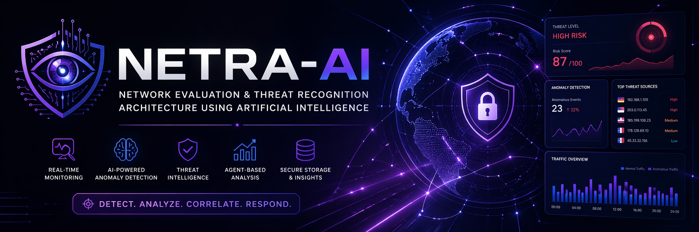
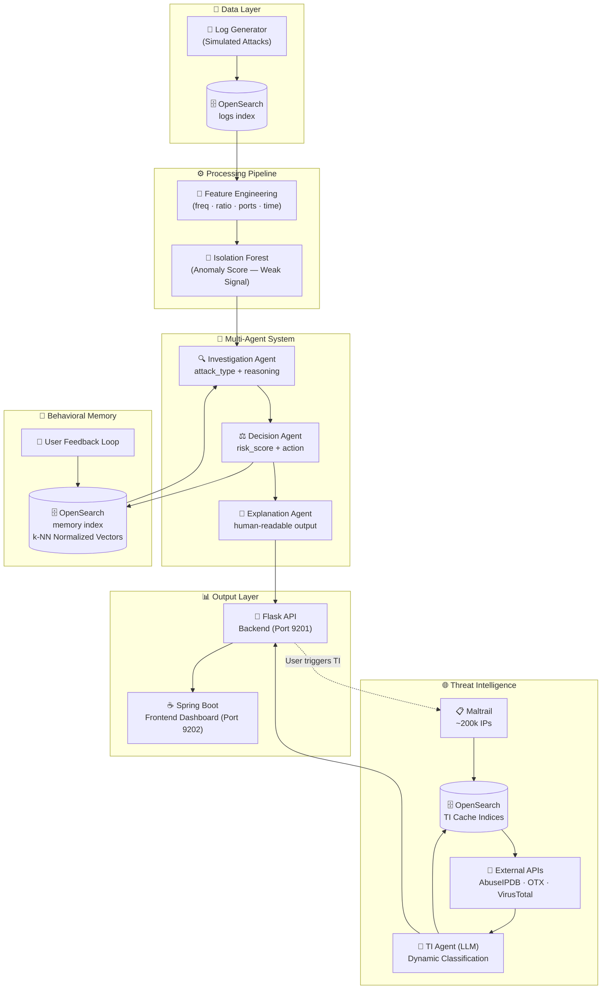
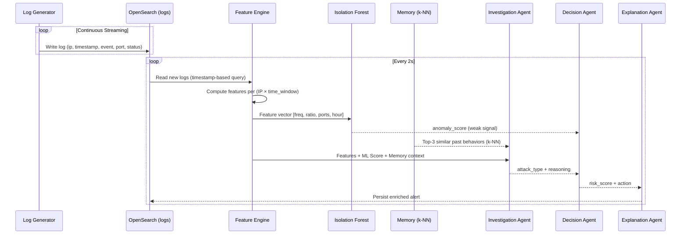
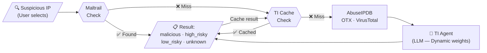
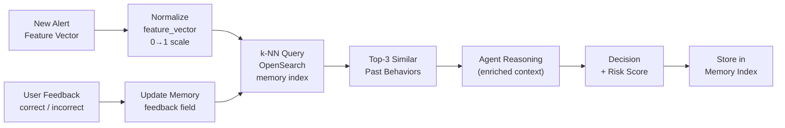
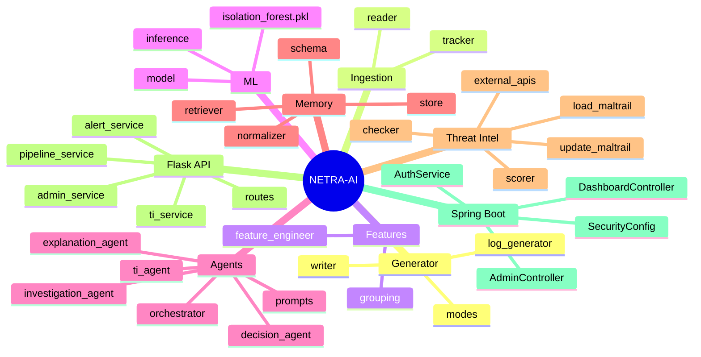
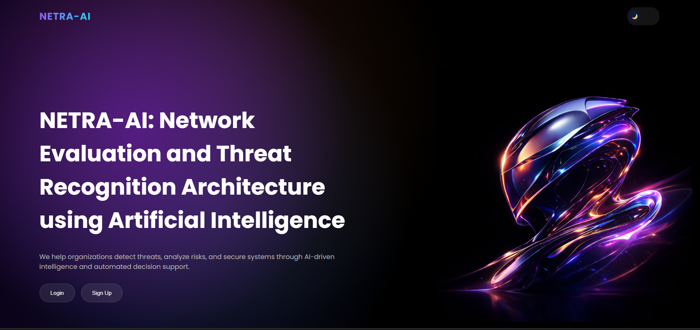
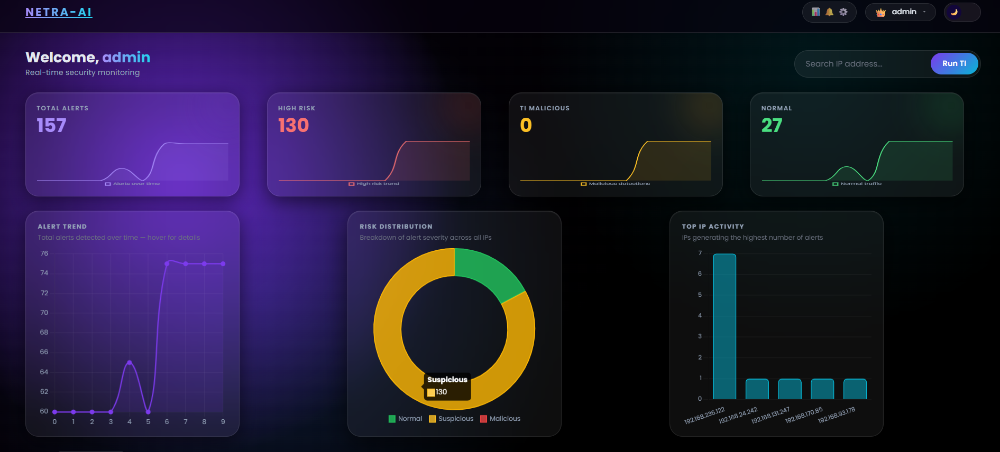
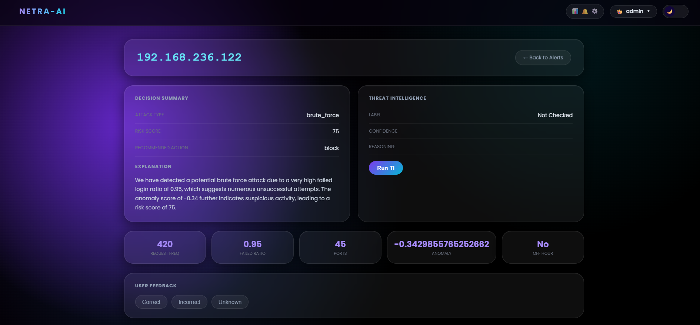
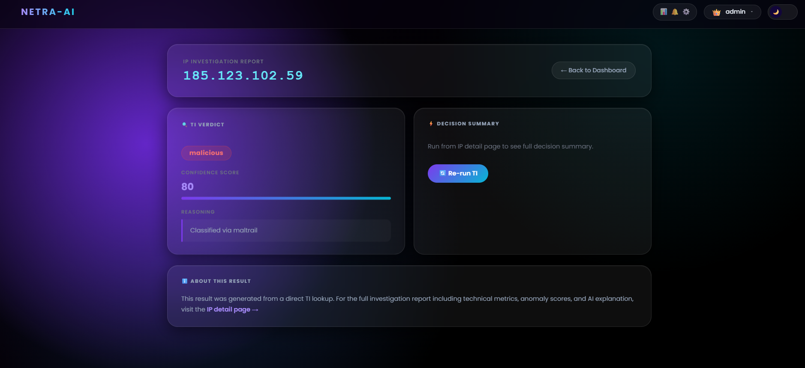

<div align="center">

# 🛡️ NETRA-AI

### *Network Evaluation and Threat Recognition Analysis using AI*

<br/>

> **An AI-Driven Security Operations Center (SOC) Platform for Intelligent Threat Detection, Behavioral Analysis & Threat Intelligence**

<br/>

<!-- ============================================================ -->
<!-- 📸 PHOTO PLACEHOLDER: Project banner/hero image             -->
<!-- Recommended size: 1200x400px, dark-themed                   -->
<!-- Save as: assets/banner.png                                  -->
<!-- ============================================================ -->


<br/>


</div>

---

## 📖 Table of Contents

- [Overview](#-overview)
- [Problem Statement](#-problem-statement)
- [Key Features](#-key-features)
- [Architecture](#-architecture)
- [System Flow](#-system-flow)
- [Tech Stack](#-tech-stack)
- [Module Breakdown](#-module-breakdown)
- [Screenshots](#-screenshots)
- [Installation & Setup](#️-installation--setup)
- [Running the System](#-running-the-system)
- [API Reference](#-api-reference)
- [Project Structure](#-project-structure)
- [Design Decisions](#-design-decisions)
- [Future Improvements](#-future-improvements)
- [Author](#-author)

---

## 🚀 Overview

**NETRA-AI** is a hybrid, AI-powered Security Operations Center (SOC) platform that simulates how real-world security analysts detect, investigate, and respond to network threats — with intelligent automation at every step.

It uniquely separates **behavioral anomaly detection** from **threat intelligence enrichment**, using a human-in-the-loop design where analysts retain final control over decisions.

> **Core Philosophy:** ML detects · Agents reason · Humans decide.

---

## 🔍 Problem Statement

Modern security systems face three fundamental challenges:

| Problem | Description |
|---|---|
| **Alert Volume** | Systems generate thousands of logs per second — impossible to analyze manually |
| **Rule-Based Limitations** | Static rules miss new and evolving attack patterns |
| **Lack of Explainability** | Alerts are raised with no context, reasoning, or actionable guidance |

**NETRA-AI** addresses all three by combining unsupervised ML (anomaly detection), multi-agent LLM reasoning, and verified external threat intelligence.

---

## ✨ Key Features

- 🔬 **Behavioral Anomaly Detection** via Isolation Forest (weak signal layer)
- 🤖 **Multi-Agent Reasoning Pipeline** — Investigation, Decision & Explanation Agents
- 🧠 **Vector-Based Behavioral Memory** — Normalized k-NN similarity using OpenSearch
- 🌐 **Threat Intelligence Engine** — Maltrail (~200k IPs) + AbuseIPDB + AlienVault OTX + VirusTotal
- 🗂️ **Cache-First TI System** — Dramatically reduces redundant external API calls
- 🔁 **Feedback Learning Loop** — User corrections stored and fed back into agent reasoning
- 🛡️ **4-Level Risk Classification** — `malicious` / `high_risky` / `low_risky` / `unknown`
- 🔐 **Role-Based Access Control** — Admin and User roles with Spring Security (BCrypt)
- 🛠️ **Admin Control Panel** — Manage TI indices, update API keys, view immutable audit logs
- 📊 **OpenSearch Dashboards** — Real-time visualization of all system data

---

## 🧩 Architecture

### High-Level System Architecture



---

## 🔄 System Flow

### Pipeline A — Behavioral Detection



### Pipeline B — Threat Intelligence (User-Triggered)



### Memory & Feedback Loop



---

## 🧱 Tech Stack

### Backend

| Layer | Technology |
|---|---|
| API Framework | Flask (Python) |
| AI / LLM | LangChain + OpenAI GPT-4o-mini |
| ML Model | Scikit-learn — Isolation Forest |
| Vector Search | OpenSearch k-NN |
| TI APIs | AbuseIPDB, AlienVault OTX, VirusTotal |

### Frontend

| Layer | Technology |
|---|---|
| Web Framework | Spring Boot |
| Templating | Thymeleaf |
| Security | Spring Security (BCrypt) |
| Auth Database | MySQL |

### Infrastructure

| Component | Technology |
|---|---|
| Primary Database | OpenSearch 2.x (Docker) |
| Visualization | OpenSearch Dashboards |
| Containerization | Docker |

---

## 📦 Module Breakdown



---

## 🖼️ Screenshots

> 📸 Save your screenshots in the `assets/screenshots/` folder and update the paths below.

### Landing Page
<!-- ============================================================ -->
<!-- 📸 PHOTO PLACEHOLDER: Admin control panel                   -->
<!-- Save as: assets/screenshots/admin.png                       -->
<!-- Should show: TI index browser, pending users, audit logs    -->
<!-- ============================================================ -->

### Main Dashboard
<!-- ============================================================ -->
<!-- 📸 PHOTO PLACEHOLDER: Full dashboard screenshot             -->
<!-- Save as: assets/screenshots/dashboard.png                   -->
<!-- Should show: KPI cards, alert table, TI search bar          -->
<!-- ============================================================ -->


### Alert Investigation View
<!-- ============================================================ -->
<!-- 📸 PHOTO PLACEHOLDER: Alert detail / IP investigation page  -->
<!-- Save as: assets/screenshots/alert_detail.png               -->
<!-- Should show: features, ML score, agent reasoning, TI result -->
<!-- ============================================================ -->


### Threat Intelligence Panel
<!-- ============================================================ -->
<!-- 📸 PHOTO PLACEHOLDER: TI classification result             -->
<!-- Save as: assets/screenshots/threat_intel.png               -->
<!-- Should show: Maltrail result, API scores, TI Agent output   -->
<!-- ============================================================ -->



---

## ⚙️ Installation & Setup

### Prerequisites

- Python 3.9+
- Java 17+ (for Spring Boot frontend)
- Maven 3.6+
- Docker Desktop
- Git
- MySQL 8.x

### 1. Clone Repository

```bash
git clone https://github.com/csushobhit/NETRA-AI.git
cd netra-ai
```

### 2. Start OpenSearch & Dashboards

```bash
# OpenSearch (Backend DB)
docker run -d -p 9200:9200 ^
  -e "discovery.type=single-node" ^
  -e "plugins.security.disabled=true" ^
  -e "OPENSEARCH_INITIAL_ADMIN_PASSWORD=YourPassword@123" ^
  -e "OPENSEARCH_JAVA_OPTS=-Xms512m -Xmx512m" ^
  opensearchproject/opensearch:2

# OpenSearch Dashboards (Optional UI)
docker run -d -p 5601:5601 ^
  -e "OPENSEARCH_HOSTS=http://host.docker.internal:9200" ^
  -e "DISABLE_SECURITY_DASHBOARDS_PLUGIN=true" ^
  opensearchproject/opensearch-dashboards:2
```

Verify OpenSearch is running: open `http://localhost:9200`

### 3. Python Environment Setup

```bash
python -m venv venv
venv\Scripts\activate          # Windows
source venv/bin/activate       # Linux/Mac

pip install -r requirements.txt
```

### 4. Configure Environment Variables

Create a `.env` file in the project root:

```env
OPENAI_API_KEY=sk-your-openai-key
ABUSEIPDB_API_KEY=your-abuseipdb-key
OTX_API_KEY=your-otx-key
VIRUSTOTAL_API_KEY=your-virustotal-key
```

### 5. Initialize OpenSearch Indices

```bash
python -m threat_intel.db.indices
```

### 6. Load Maltrail Threat Database (One-Time)

```bash
# Clones Maltrail repo and indexes ~200k known malicious IPs
python -m threat_intel.init.load_maltrail
```

> ⏱️ This takes 5–15 minutes due to the dataset size.

### 7. Train the ML Model

```bash
# First generate logs for ~30–60 minutes, then:
python -m scripts.train_model
```

The trained model is saved to `models/isolation_forest.pkl`.

### 8. Frontend (Spring Boot)

Create MySQL database:

```sql
CREATE DATABASE soc_frontend;
```

Configure `soc-frontend/src/main/resources/application.properties`:

```properties
spring.datasource.url=jdbc:mysql://localhost:3306/soc_frontend
spring.datasource.username=root
spring.datasource.password=your-mysql-password
spring.jpa.hibernate.ddl-auto=update
server.port=9202
```

```bash
cd soc-frontend
mvn spring-boot:run
```

---

## 🚀 Running the System

Open three terminals and run in order:

```bash
# Terminal 1 — Simulates network traffic (attacks + normal)
python -m generator.log_generator

# Terminal 2 — AI processing pipeline
python app/main.py

# Terminal 3 — Web dashboard
cd soc-frontend && mvn spring-boot:run
```

| Service | URL | Description |
|---|---|---|
| Frontend Dashboard | `http://localhost:9202` | Main SOC interface |
| Flask Backend API | `http://localhost:9201` | REST API |
| OpenSearch | `http://localhost:9200` | Database |
| Dashboards | `http://localhost:5601` | Visualization |

**Default admin login:** `admin` / `admin@123`

---

## 🔌 API Reference

### Detection & Alerts

| Method | Endpoint | Description |
|---|---|---|
| `GET` | `/dashboard` | KPIs: total, suspicious, normal, TI malicious counts |
| `GET` | `/alerts` | All processed alerts |
| `GET` | `/alerts?filter=suspicious` | Suspicious alerts only |
| `GET` | `/alerts?hours=1` | Alerts from last N hours |
| `GET` | `/alerts/<ip>` | Full alert history for a specific IP |

### Threat Intelligence

| Method | Endpoint | Body / Params | Description |
|---|---|---|---|
| `GET` | `/search?ip=<ip>` | — | TI check on single IP |
| `POST` | `/run-ti` | `{"ip": "x.x.x.x"}` | User-triggered TI analysis |
| `POST` | `/bulk-ti` | `{"ips": ["..."]}` | Bulk TI on selected IPs |

### Feedback

| Method | Endpoint | Body | Description |
|---|---|---|---|
| `POST` | `/feedback` | `{"ip": "...", "feedback": "correct"}` | Agent feedback |

### Admin

| Method | Endpoint | Description |
|---|---|---|
| `GET` | `/admin/ti/<index>` | Browse TI index with pagination |
| `POST` | `/admin/ti/delete` | Remove IP from any TI index |
| `GET` | `/admin/audit` | Immutable audit log |
| `POST` | `/admin/update-keys` | Update API keys in `.env` |
| `POST` | `/admin/update-maltrail` | Pull latest Maltrail updates |

---

## 📁 Project Structure

```
netra-ai/
│
├── agents/                        # Multi-agent AI reasoning
│   ├── investigation_agent.py     # Attack classification
│   ├── decision_agent.py          # Risk scoring + action
│   ├── explanation_agent.py       # Human-readable output
│   ├── ti_agent.py                # TI dynamic classification
│   ├── orchestrator.py            # Agent pipeline controller
│   └── prompts.py                 # All LLM prompts
│
├── api/                           # Flask REST layer
│   ├── routes.py
│   ├── pipeline_service.py        # Background pipeline thread
│   ├── alert_service.py
│   ├── ti_service.py
│   ├── admin_service.py
│   └── init_indices.py
│
├── config/
│   ├── llm_config.py
│   └── env_config.py
│
├── db/
│   └── opensearch_client.py
│
├── features/
│   ├── feature_engineer.py        # Stateful per-IP aggregation
│   └── grouping.py
│
├── generator/
│   ├── log_generator.py
│   ├── modes.py                   # Normal/Brute/Spike/Scan
│   └── writer.py
│
├── ingestion/
│   ├── reader.py                  # Timestamp-based OS reader
│   └── tracker.py
│
├── memory/
│   ├── normalizer.py              # Feature normalization (0–1)
│   ├── retriever.py               # k-NN behavioral similarity
│   ├── schema.py
│   └── store.py
│
├── ml/
│   ├── model.py
│   └── inference.py
│
├── models/
│   └── isolation_forest.pkl
│
├── scripts/
│   └── train_model.py
│
├── soc-frontend/                  # Spring Boot web application
│   └── src/main/java/com/soc/socfrontend/
│       ├── controller/
│       ├── service/
│       ├── model/
│       ├── repository/
│       └── config/
│
├── threat_intel/
│   ├── db/
│   │   ├── indices.py             # All index definitions
│   │   └── queries.py
│   ├── init/
│   │   ├── load_maltrail.py       # Bulk loader (one-time)
│   │   └── update_maltrail.py     # Incremental updater
│   └── services/
│       ├── checker.py             # Core TI classification flow
│       ├── external_apis.py       # API integrations
│       ├── scorer.py
│       └── ti_input_builder.py
│
├── .env                           # API keys (not committed)
├── requirements.txt
└── README.md
```

---

## 🎯 Design Decisions

**Why Isolation Forest as a Weak Signal?**
It detects statistical anomalies without labeled training data. Its score is passed to AI agents as supporting evidence rather than a final verdict — keeping decisions explainable and the model replaceable.

**Why Multi-Agent Architecture?**
Separating Investigation → Decision → Explanation into distinct agents makes each component independently testable and replaceable. If LLM costs become prohibitive, any agent can be substituted with deterministic logic without breaking the others.

**Why Keep Detection and TI Pipelines Separate?**
They answer fundamentally different questions. Detection asks "is this behavior unusual?" — TI asks "is this IP known-bad?" Merging them creates opaque decisions; keeping them separate preserves explainability and modularity.

**Why Human-in-the-Loop?**
Automated blocking without analyst review introduces risk in real SOC environments. NETRA-AI enriches and prioritizes — the analyst retains final action authority.

**Why OpenSearch over a Traditional Database?**
OpenSearch provides full-text search, time-series range queries, k-NN vector similarity (for memory), real-time indexing, and built-in Dashboards — all critical for a live SOC platform in a single deployment.

**Why Normalize Vectors in Memory?**
OpenSearch k-NN uses Euclidean distance. Without normalization, `request_freq` (0–200+) would dominate `failed_ratio` (0–1), making similarity meaningless. Normalization ensures all behavioral dimensions contribute equally.

---

## 📊 OpenSearch Index Reference

| Index | Purpose | Key Fields |
|---|---|---|
| `logs` | Raw network events | `ip`, `timestamp`, `event_type`, `status`, `port` |
| `alerts` | Enriched detections | `ip`, `attack_type`, `risk_score`, `action`, `ti_label` |
| `memory` | Behavioral memory (k-NN) | `ip`, `feature_vector`, `decision`, `risk`, `feedback` |
| `maltrail_ips` | Known malicious IPs | `ip`, `status`, `source` |
| `known_malicious_ips` | TI-confirmed malicious | `ip`, `score`, `source` |
| `known_risky_ips` | High-risk cache | `ip`, `score`, `source` |
| `known_low_risky_ips` | Low-risk cache | `ip`, `score`, `source` |
| `known_unknown_ips` | Unresolved cache | `ip`, `score`, `source` |

---

## 🔮 Future Improvements

- [ ] WebSocket-based real-time alert streaming (replace polling)
- [ ] Domain and URL threat intelligence support
- [ ] MISP integration for enterprise-grade threat feeds
- [ ] Kafka integration for distributed high-volume log ingestion
- [ ] Automated incident response workflows
- [ ] Correlation engine — link related alerts across multiple IPs
- [ ] ML model retraining pipeline driven by accumulated feedback
- [ ] Attack timeline replay with step-by-step visualization
- [ ] CIDR range support in Maltrail ingestion

---

## 👤 Author

<div align="center">

**Sushobhit Chattaraj**

*Final Year Project — Computer Science Engineering*

<!-- ============================================================ -->
<!-- 📸 PHOTO PLACEHOLDER: Your profile/headshot photo           -->
<!-- Save as: assets/author.png                                  -->
<!-- Recommended: 150x150px square crop                          -->
<!-- ============================================================ -->

[](https://www.linkedin.com/in/sushobhit-chattaraj-410b2a253/)
[](https://github.com/csushobhit)

</div>

---

<div align="center">

*Designed as a practical, scalable, and explainable AI-SOC system*

<br/>

**⭐ Star this repository if you found it useful!**

</div>